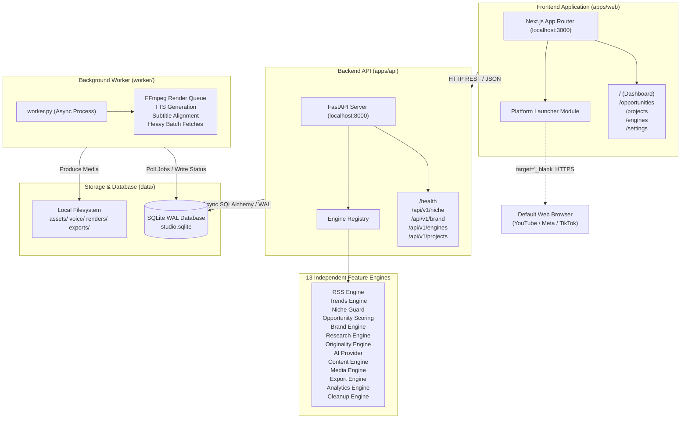

# Architecture Overview — Fresh Local AI Content Studio

## 1. System Topology

## 2. Core Architectural Principles
1. **Engine Independence:** Engines communicate only through typed inputs and outputs defined in `contracts.py`. Modifying an internal engine implementation (e.g., swapping RSS parsers or adjusting trend weights) has zero side effects on unrelated engines.
2. **Local-First Reliability:** Single-user operation runs without Docker, external Postgres, or Redis daemons. SQLite WAL mode provides high-concurrency read access during background worker processing.
3. **Decoupled Heavy Processing:** HTTP request handlers never execute blocking FFmpeg renders or long batch scrapes. Jobs are enqueued in SQLite and executed by `worker.py`.
4. **Auditability & Explainability:** Every engine execution records input counts, output counts, rejected items, latency, cost, and human-readable explanation logs.
