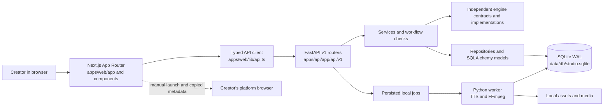

# V1.01 Structural Backbone

**Status:** Implemented on the V1.01 feature branch, based on the integrated Phase 23 Gemini-only release. This document describes current code. Items under “Future engine work” are plans, not implemented capabilities.

## System structure

The web application is a presentation and navigation layer. Pages call the typed client in `apps/web/lib/api.ts`; they do not import Python engines or implement their approval rules. FastAPI routers translate those application requests into service, repository, and engine calls. Repositories and SQLAlchemy models own persisted state. The local worker handles long-running media jobs. SQLite and files remain local.

The top-level layout is provided by `AppShell`, with the route title, language toggle, health indicator, and shared `Navigation`. The creator workflow is a dashboard presentation over the existing cockpit summary and content-family APIs. `LanguageContext` and `translations.ts` provide English and Bangla strings. Dynamic script and publishing pages remain item-scoped and are reached from existing content-family, quality-gate, and publishing links.

## Creator workflow map

Topic approval, research verification, script approval, final QC, and feedback application remain explicit creator actions. The dashboard does not execute those actions or mark them complete because a page was visited.

The dashboard's **Next action** recommendation uses the existing setup and opportunity lifecycle counts from `/api/v1/settings/status` and `/api/v1/opportunities/cockpit/summary`. Its **Current work** panel reads one non-archived content family through `/api/v1/content-families` and `/api/v1/content-families/{id}`. It shows the family, the first unfinished child item (or the last item when all are terminal), the saved child status, and saved checkpoints. A checkpoint says “linked” when an ID exists; it does not claim that a linked packet or plan is verified or approved. The panel only calls evidence “selected and verified” when the child-item response reports a verified selection. Script Studio and the backend continue to validate generation eligibility.

Known saved blockers have direct explanations and links: an unapproved `DRAFT` family, a missing research packet, a missing originality plan, no selected verified evidence, or a `REJECTED` item. Other decisions remain in their existing tools, where the backend owns detailed eligibility and error messages. No workflow stage is advanced by navigation.

## Navigation organization

The desktop sidebar and mobile drawer share one route definition in `apps/web/components/Navigation.tsx`. Groups expand and collapse; route links use `aria-current="page"`, active routes open their group, and native buttons provide keyboard operation. The mobile drawer closes on navigation or Escape. Labels are translated in English and Bangla.

| Navigation group | Existing routes |
|---|---|
| Dashboard | `/` |
| Discover | `/sources`, `/trends`, `/opportunities` |
| Verify | `/research`, `/evidence`, `/originality` |
| Create | `/content-families`, `/projects` |
| Produce | `/asset-rights`, `/scene-studio`, `/media-studio`, `/quality-gate` |
| Publish | `/publishing` |
| Learn | `/analytics`, `/feedback`, `/audience` |
| Studio tools | `/ai`, `/engines`, `/cleanup`, `/settings` |

The 24 existing pages remain available. Item-specific routes (`/script-studio/[itemId]`, `/publishing/[itemId]`, and `/content-families/[id]`) keep their identifiers and are linked from the relevant existing pages; V1.01 does not add placeholder routes.

## Engine responsibility and stable boundaries

The following map focuses on the research-to-export path. Contracts are defined under `apps/api/app/engines/<engine>/contracts.py`; application routes are under `apps/api/app/api/v1/`.

| Area | Current responsibility and contract | Dependencies and validation | User access |
|---|---|---|---|
| Research | Turns an approved topic and sources into versioned packets containing sources, facts, claims, metrics, contradictions, uncertainty, and “do not claim” boundaries. `ResearchEngineInput` → `ResearchEngineResult`; packet records use `ResearchPacketItem`. | The research repository persists packet revisions and verification. Script generation requires the linked packet to be verified. | `/research`; `/api/v1/research/packets` |
| Evidence | Maintains claim/source provenance, empirical runs and conclusions, and coverage. `EvidenceEngineInput` → `EvidenceEngineOutput`; public shapes include `ProvenanceTrace`, `CoverageReport`, `CreateClaimInput`, and `LinkEvidenceInput`. | Uses research claims and source references; selected script claims must be verified and belong to the packet. | `/evidence`; `/api/v1/evidence` |
| Originality | Records the specific value-add plan and formats, detects generic-summary cases, and supports experiments. `CreatePlanRequest` → `PlanEvaluationResult`. | Uses a research packet and evidence; a non-generic plan must receive human approval before script generation. | `/originality`; `/api/v1/originality/plans` |
| Content families and Script Studio | Families share research/originality investment; child items carry format, platform, evidence selection, and lifecycle status. Script requests use `GenerateScriptRequest`; outputs use `ScriptDraftOutput` with structured sections and quality results. | Script service checks approved topic when linked, verified packet, approved non-generic originality plan, and selected verified claims. It validates structure, claim IDs, numeric evidence, pacing, and brand rules before saving. Script approval is a separate human transition. Live generation remains Gemini-only; Mock is deterministic and not approvable. | `/content-families`, `/projects`, `/script-studio/[itemId]`; `/api/v1/scripts` |
| Scene Studio | Decomposes an approved script into ordered, evidence-aware storyboard scenes. `DecompositionRequest` produces scene records; `StoryboardValidationResult` reports validation. | Depends on an existing script and its visual cues. Asset selection and rights remain in their own records and routes. | `/scene-studio`; `/api/v1/scenes` |
| Media Studio | Synthesizes voice, generates subtitles, and renders validated local assets into a media package. Contracts include `VoiceConfigRequest`, `SubtitleConfigRequest`, `MediaRenderConfigRequest`, and `MediaRenderOutput`. | Media jobs persist through the API and local worker. Production checks use installed voices, local assets, FFmpeg, and FFprobe; Mock or failed output cannot satisfy production QC. | `/media-studio`; `/api/v1/media`, local worker |
| Quality Gate | Evaluates evidence, brand, originality, viewer value, niche, repetition, asset rights, media QC, and cost. `QualityGateAuditResponse` carries dimensions, recommendations, score, and approval state. | Final approval is a separate human action. The backend re-evaluates current state and blocks failed/mock media; export checks freshness of the approval and script. | `/quality-gate`; `/api/v1/quality-gate` |
| Export and manual publishing | Builds an offline package and checksum manifest; platform records track ready, published, or skipped states. `ExportEngineInput` → `ExportPackageOutput`. | Requires current final QC approval and eligible production media. Platform publishing remains manual; the app copies metadata and opens configured platform pages. | `/publishing`, `/publishing/[itemId]`; `/api/v1/export` and `/api/v1/publishing` |

Analytics, feedback, audience, asset rights, and cleanup remain separate routes and engines. The workflow UI links to them without importing their internal implementations.

### Stable integration boundaries

- Keep engine inputs, outputs, manifests, and validation inside each engine package.
- Keep HTTP request/response contracts in FastAPI routers and Pydantic schemas; the frontend consumes them through `lib/api.ts` and typed data shapes.
- Keep durable eligibility in persisted records and backend gates. The dashboard can summarize returned states but cannot approve content or replace server validation.
- Keep media processing in the local worker and keep publication as creator-operated browser actions.
- A future engine can change its prompt, guidelines, model, or rendering implementation independently if it preserves the agreed API and persistence contract or versions an intentional contract change.

## Remaining architectural risks

- The dashboard's stage recommendation is a useful priority heuristic over aggregate counts, not a complete multi-item scheduler. The current-work card shows one active family; other families remain available from the content-family list.
- Family detail returns linked research and originality IDs but not every upstream verification/approval field. The dashboard avoids claiming those links are approved and routes users to the authoritative engine. Script generation rechecks them server-side.
- Script Studio and item-specific publishing have no collection route of their own; users enter through their content item. This is deliberate for V1.01, but future navigation work should retain the item context.
- Existing documentation outside this V1.01 map includes older architectural summaries. This document describes the inspected V1.01 route and contract boundaries and should be updated when those contracts change.

## Future engine work — planned, not implemented

| Future phase | Independent improvement area | Boundary to preserve |
|---|---|---|
| Research | Improve source extraction, claim quality, contradiction handling, and creator verification guidance. | Versioned `ResearchPacketItem`, revision history, and verification gate. |
| Evidence | Improve source provenance, claim verification criteria, and experiment/result capture. | Claim IDs, provenance links, and `CoverageReport` semantics. |
| Originality | Improve value-add planning, quality criteria, and experiment design. | A persisted non-generic plan with explicit human approval. |
| Script Studio | Improve format-specific guidance, prompts, and model choice in a separate engine phase. | `GenerateScriptRequest`, structured `ScriptDraftOutput`, evidence/provenance metadata, and script approval. |
| Scene Studio | Improve storyboard decomposition, visual hierarchy, and scene-level evidence guidance. | Ordered scene records and validated script/scene association. |
| Media Studio | Evaluate new local or specialized rendering technologies in a separate media phase. | Media package status, production validation, local job lifecycle, and QC/export eligibility. |
| Quality Gate | Evolve dimensions and correction guidance with explicit contract/version changes. | Fresh server-side evaluation and final human approval. |
| Export | Improve package formats or launch preparation while preserving checksum and eligibility checks. | Offline package provenance and manual platform publishing. |

V1.01 does not add providers, provider fallback, new generation models, a rendering framework, automated publishing, or an unused extension/plugin system.
